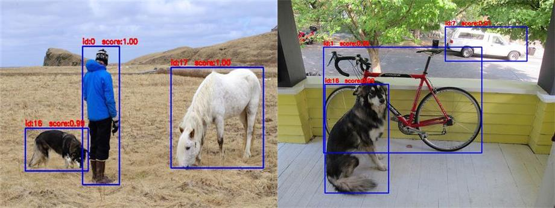

# Yolov5 Yolov4 Yolov3 TensorRT Implementation

    

__news:__ yolov5 support


## INTRODUCTION

The project is the encapsulation  of nvidia official yolo-tensorrt [implementation](https://github.com/NVIDIA-AI-IOT/deepstream_reference_apps). And you must have the trained yolo model(__.weights__) and __.cfg__ file from the darknet (yolov3 & yolov4). For the [yolov5](https://github.com/ultralytics/yolov5) ,you should prepare the model file (yolov5s.yaml) and the trained weight file (yolov5s.pt) from pytorch.


- [x] yolov5s , yolov5m , yolov5l , yolov5x [tutorial](yolov5_tutorial.md)
  - [x] inequal size net input
  - [x] batch inference
  - [x] support FP32,FP16,INT8
  - [ ] daynamic input size
- [x] yolov4 , yolov4-tiny
- [x] yolov3 , yolov3-tiny


## PLATFORM & PERFORMENCE

- [x] windows 10
- [x] ubuntu 18.04
- [x] L4T (Jetson platform)

|     model      |             gpu              | precision | detect time(with pre and post process) |
| :------------: | :--------------------------: | :-------: | :------------------------------------: |
| yolov3-416x416 |      jetson nano (15w)       |   FP16    |                 250ms                  |
| yolov3-416x416 | jetson xavier nx (15w 6core) |   FP32    |                 120ms                  |
| yolov3-416x416 | jetson xavier nx (15w 6core) |   FP16    |                  45ms                  |
| yolov3-416x416 | jetson xavier nx (15w 6core) |   INT8    |                  35ms                  |

## WRAPPER

Prepare the pretrained __.weights__ and __.cfg__ model. 

```c++
Detector detector;
Config config;

std::vector<BatchResult> res;
detector.detect(vec_image, res)
```

## Build and use yolo-trt as DLL or SO libraries


### windows10

- dependency : TensorRT 7.1.3.4  , cuda 11.0 , cudnn 8.0  , opencv4 , vs2015
- build:
  
    open MSVC _sln/sln.sln_ file 
    - dll project : the trt yolo detector dll
    - demo project : test of the dll

### ubuntu & L4T (jetson)

The project generate the __libdetector.so__ lib, and the sample code.
**_If you want to use the libdetector.so lib in your own project,this [cmake file](https://github.com/enazoe/yolo-tensorrt/blob/master/scripts/CMakeLists.txt) perhaps could help you ._**


```bash
git clone https://github.com/enazoe/yolo-tensorrt.git
cd yolo-tensorrt/
mkdir build
cd build/
cmake ..
make
./yolo-trt
```
- **jetson nano**  JetPack 4.2.2
	
	*note:*  set **_compute_53,code=sm_53_** at cmake file.

- **jetson xavier nx**  JetPack 4.4
	
	*note:*  set **_compute_72,code=sm_72_** at cmake file.

## API

```c++
struct Config
{
	std::string file_model_cfg = "configs/yolov4.cfg";

	std::string file_model_weights = "configs/yolov4.weights";

	float detect_thresh = 0.9;

	ModelType net_type = YOLOV4;

	Precision inference_precison = INT8;
	
	int gpu_id = 0;

	std::string calibration_image_list_file_txt = "configs/calibration_images.txt";

	int n_max_batch = 4;	
};

class API Detector
{
public:
	explicit Detector();
	~Detector();

	void init(const Config &config);

	void detect(const std::vector<cv::Mat> &mat_image,std::vector<BatchResult> &vec_batch_result);

private:
	Detector(const Detector &);
	const Detector &operator =(const Detector &);
	class Impl;
	Impl *_impl;
};
```

## REFERENCE

- https://github.com/wang-xinyu/tensorrtx/tree/master/yolov4
- https://github.com/mj8ac/trt-yolo-app_win64
- https://github.com/NVIDIA-AI-IOT/deepstream_reference_apps